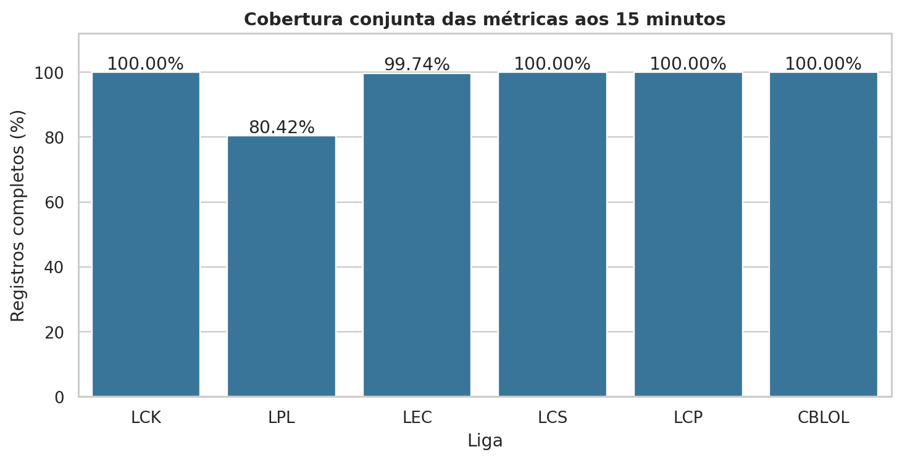
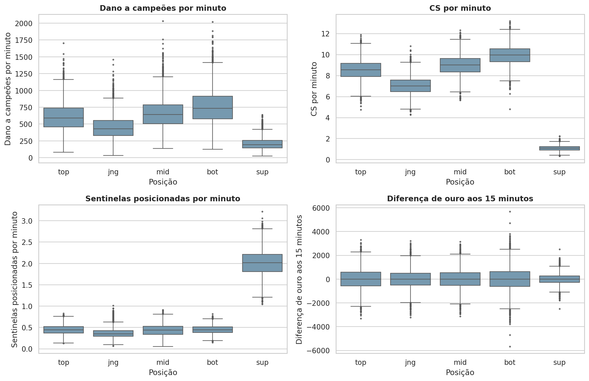
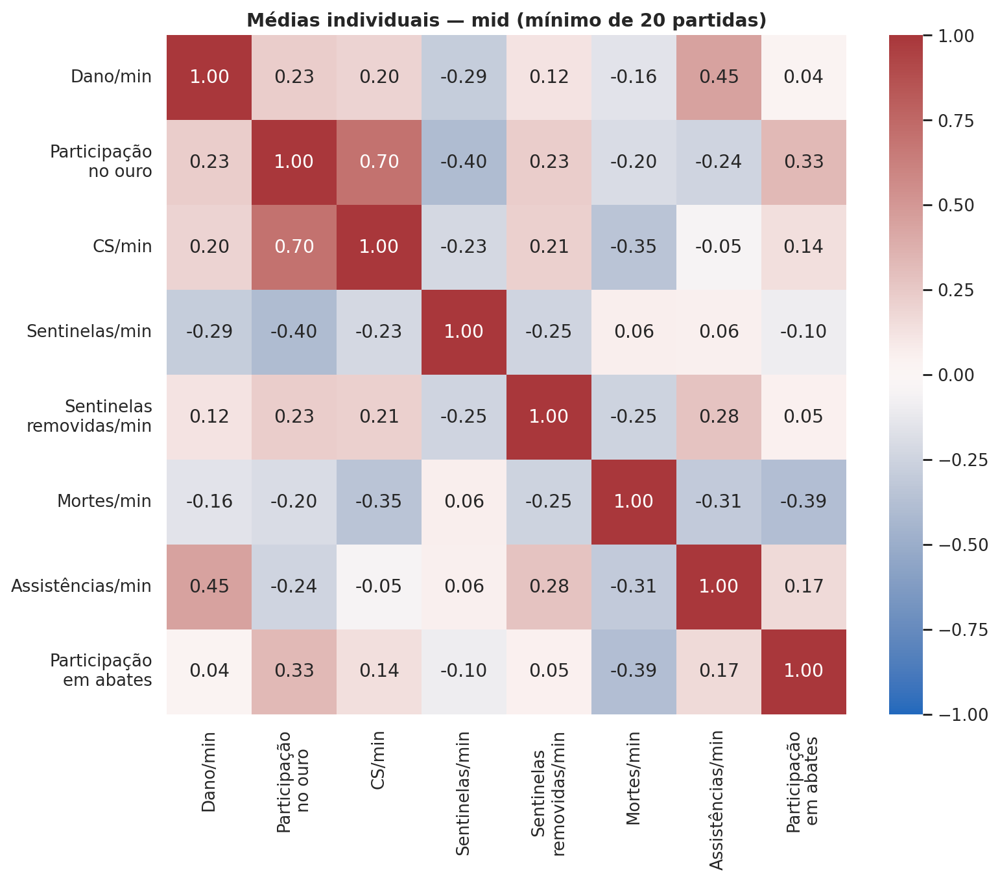
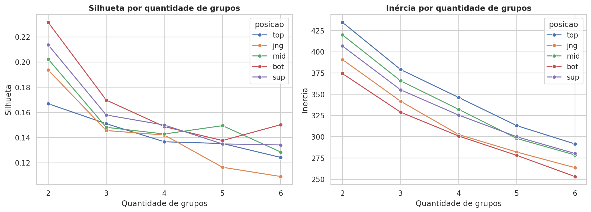
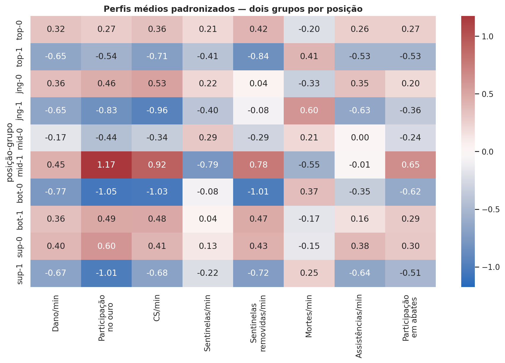
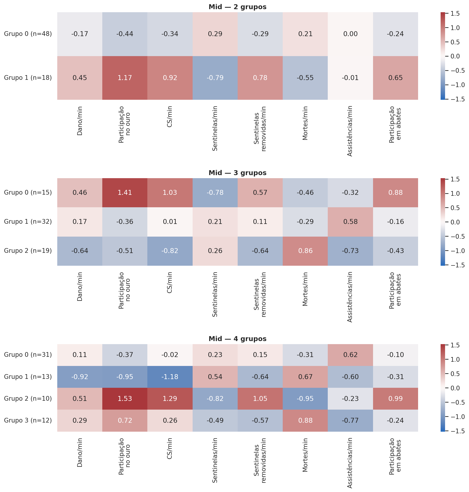
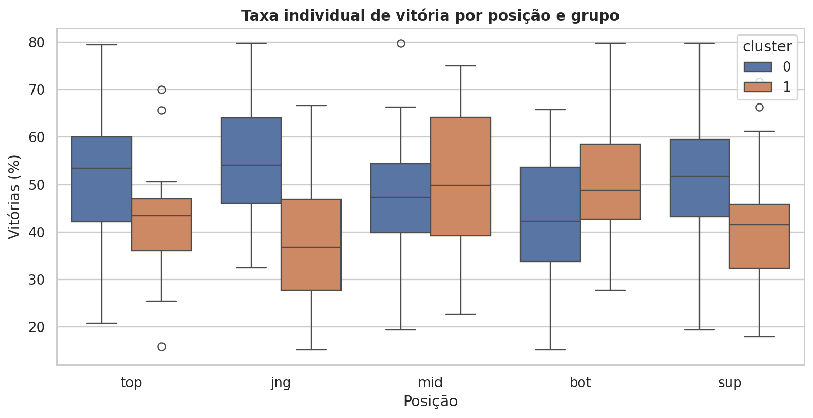
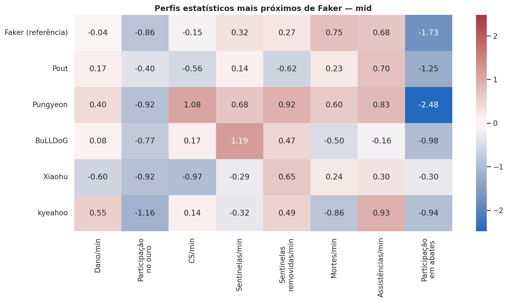

# RiftCluster

**Análise exploratória, modelagem não supervisionada e busca de similaridade entre jogadores profissionais de League of Legends.**

RiftCluster combina **Rift**, referência a Summoner’s Rift, e **Cluster**, o agrupamento estatístico utilizado no projeto. O nome representa uma análise de dados que também gera modelos, sem sugerir um ranking automático de habilidade.

O projeto transforma registros individuais de partidas em perfis de jogadores, explora suas características e ajusta modelos K-Means por posição. Uma busca por distância euclidiana complementa os grupos, permitindo consultar jogadores com características estatísticas próximas.

> **Resultado central:** dois grupos por posição foram a configuração de maior silhueta entre as alternativas testadas e apresentaram elevada repetibilidade entre inicializações. Ainda assim, a separação foi pouco marcada. Os agrupamentos descrevem diferenças relativas de recursos e produção estatística; não demonstram a existência de estilos táticos naturais nem medem habilidade individual.

## Sumário

1. [Objetivo e perguntas](#objetivo-e-perguntas)
2. [Escopo e origem dos dados](#escopo-e-origem-dos-dados)
3. [Conteúdo deste pacote](#conteúdo-deste-pacote)
4. [Tecnologias](#tecnologias)
5. [Fluxo metodológico](#fluxo-metodológico)
6. [Separação e seleção](#separação-e-seleção)
7. [Qualidade dos dados](#qualidade-dos-dados)
8. [Engenharia dos perfis](#engenharia-dos-perfis)
9. [Análise exploratória](#análise-exploratória)
10. [Entradas e padronização](#entradas-e-padronização)
11. [Modelagem com K-Means](#modelagem-com-k-means)
12. [Interpretação dos grupos](#interpretação-dos-grupos)
13. [Testes com maior detalhamento](#testes-com-maior-detalhamento)
14. [Vitórias e contexto competitivo](#vitórias-e-contexto-competitivo)
15. [Busca de jogadores semelhantes](#busca-de-jogadores-semelhantes)
16. [Reprodução no notebook](#reprodução-no-notebook)
17. [Persistência e reutilização](#persistência-e-reutilização)
18. [Limitações](#limitações)
19. [Conclusões e próximos passos](#conclusões-e-próximos-passos)
20. [Referências](#referências)

## Objetivo e perguntas

O objetivo é investigar padrões entre jogadores profissionais a partir de suas estatísticas, utilizando dados reais do Oracle’s Elixir e aprendizado não supervisionado.

As perguntas que orientam o projeto são:

- Como dano, farm e visão variam entre posições?
- Quais jogadores apresentam combinações semelhantes de recursos e participação em combate?
- Quantos grupos oferecem uma segmentação interpretável e repetível?
- Aumentar a quantidade de grupos revela combinações adicionais ou apenas fragmenta os perfis?
- Como os agrupamentos se relacionam com vitórias e equipes?
- Quais jogadores são estatisticamente mais próximos de um jogador de referência?

Não existe uma coluna com o “estilo correto” de cada jogador. O modelo aprende uma divisão a partir das características fornecidas; os significados dos grupos são interpretados posteriormente. A tarefa não é prever o vencedor de uma partida, avaliar mecanicamente a qualidade de um jogador ou classificar estilos previamente rotulados.

## Escopo e origem dos dados

| Item | Recorte utilizado |
| --- | --- |
| Fonte | Oracle’s Elixir, dados de partidas profissionais |
| Arquivo de entrada | `2026_LoL_esports_match_data_from_OraclesElixir.csv` |
| Arquivo completo | 112.752 linhas e 165 colunas |
| Registros individuais no arquivo completo | 93.960 |
| Registros de equipes no arquivo completo | 18.792 |
| Recorte de jogadores nas seis ligas selecionadas | 23.720 linhas |
| Período observado nesse recorte | 14/01/2026 a 01/10/2026 |
| Perfis antes do corte de partidas | 416 perfis de 414 jogadores únicos |
| Perfis com pelo menos 20 partidas | 324 |
| Modelos de referência | Um K-Means com dois grupos para cada uma das cinco posições |
| Variáveis por modelo | Oito médias individuais padronizadas |

O ano no nome do arquivo não significa uma temporada completa. As datas foram extraídas do CSV; não foi inferido um fuso horário para seus timestamps. Os números deste README correspondem à cópia fornecida, não a uma consulta ao vivo da fonte.

As seis ligas regionais selecionadas são `LCK`, `LPL`, `LEC`, `LCS`, `LCP` e `CBLOL`. Torneios internacionais, ligas de desenvolvimento e demais competições presentes no arquivo ficam fora desse recorte. As seis ligas pertencem ao circuito regional de primeira divisão considerado para 2026, mas isso não implica equivalência de força entre elas.

Para rastrear a versão exata do arquivo utilizado:

```text
SHA-256: 5402817cd5c7e55ac2e6a9921e5129faab02c2d31d8c9450108a4b2a2b3db4cf
```

## Conteúdo deste pacote

Este ZIP contém o README e oito imagens PNG com os gráficos essenciais. Os gráficos foram reproduzidos a partir do CSV fornecido, seguindo as transformações e parâmetros usados na análise. Os caminhos são relativos, permitindo visualizar as imagens após extrair o pacote ou publicá-lo em um repositório compatível com Markdown.

| Caminho | Conteúdo |
| --- | --- |
| `README.md` | Documentação metodológica, resultados e orientações de reprodução |
| `gráficos/01_cobertura_15min.png` | Disponibilidade das métricas aos 15 minutos |
| `gráficos/02_metricas_por_posicao.png` | Distribuições por função no jogo |
| `gráficos/03_correlacoes_perfis_mid.png` | Correlações nas médias individuais de mid |
| `gráficos/04_avaliacao_kmeans.png` | Silhueta e inércia para 2 a 6 grupos |
| `gráficos/05_perfis_grupos_k2.png` | Características dos grupos de referência |
| `gráficos/06_mid_comparacao_k.png` | Comparação de 2, 3 e 4 grupos no mid |
| `gráficos/07_vitorias_por_grupo.png` | Distribuição da taxa individual de vitória |
| `gráficos/08_similaridade_faker.png` | Exemplo de busca por similaridade |

**O pacote de documentação não inclui o CSV bruto, o notebook nem os modelos serializados.** As instruções de execução e salvamento abaixo correspondem ao notebook desenvolvido no projeto. As tabelas essenciais estão incorporadas neste README.

## Tecnologias

| Ferramenta | Função |
| --- | --- |
| Python | Processamento, análise e modelagem |
| Pandas | Leitura do CSV, filtros, tratamento, agregações e tabelas |
| NumPy | Operações numéricas e suporte às bibliotecas |
| Matplotlib e Seaborn | Gráficos exploratórios e de avaliação |
| scikit-learn | StandardScaler, K-Means, silhueta e ARI |
| SciPy | Suporte ao cálculo de correlações de Spearman |
| Jupyter e ipykernel | Execução documentada em notebook |
| Joblib | Persistência de scalers, modelos e objetos associados |
| pathlib e json | Organização dos arquivos e registro de metadados |

Versões do ambiente utilizado para reproduzir os resultados deste pacote: `pandas 2.2.3`, `numpy 2.3.5`, `scikit-learn 1.8.0`, `matplotlib 3.10.8`, `seaborn 0.13.2`. Versões diferentes, ordem dos registros e alterações na fonte podem produzir diferenças numéricas ou permutações dos rótulos dos grupos.

## Fluxo metodológico

1. Carregar o CSV e identificar a unidade de cada registro.
2. Separar jogadores e equipes pela coluna `position`.
3. Selecionar as seis ligas regionais.
4. Preservar contexto e selecionar métricas candidatas.
5. Padronizar tipos, verificar duplicatas e mapear valores ausentes.
6. Explorar distribuições por posição e contexto competitivo.
7. Calcular taxas por partida e agregar por jogador e posição.
8. Avaliar quantidade de partidas, variação e correlações.
9. Selecionar perfis com pelo menos 20 partidas e oito características.
10. Padronizar as entradas separadamente por posição.
11. Ajustar K-Means com 2 a 6 grupos e avaliar suas divisões.
12. Investigar estabilidade, detalhamento e relação com vitórias.
13. Consultar vizinhos estatísticos e preparar a persistência dos resultados.

## Separação e seleção

### Unidade dos registros

`position = team` identifica os registros coletivos. Os valores `top`, `jng`, `mid`, `bot` e `sup` identificam registros individuais. A separação gera `df_jogadores` e `df_times`, preservando o DataFrame original.

Uma linha individual representa **uma atuação de um jogador em uma partida**. Ela não equivale a um jogador único. Por exemplo, 1.004 registros de mid na LCK representam os dois mids de 502 partidas no arquivo analisado.

O recorte de primeira divisão gera `df_jogadores_principais` e `df_times_principais`. A modelagem descrita aqui utiliza os jogadores; a base de equipes é preservada para análises complementares.

### Colunas preservadas na preparação

| Grupo | Colunas |
| --- | --- |
| Identificação e contexto | `gameid`, `datacompleteness`, `league`, `split`, `playoffs`, `date`, `patch`, `side`, `position`, `playerid`, `playername`, `teamid`, `teamname`, `champion`, `result` |
| Preparação das taxas | `gamelength`, `kills`, `deaths`, `assists`, `teamkills` |
| Métricas candidatas iniciais | `dpm`, `damageshare`, `earnedgoldshare`, `cspm`, `wpm`, `wcpm`, `golddiffat15`, `xpdiffat15`, `csdiffat15` |

Isso resulta em 29 colunas na primeira seleção. Identificadores, liga, equipe, campeão, resultado e contagens não entram como características do clustering. São usados para organizar, verificar e interpretar os dados.

Colunas de draft, multikills, objetivos coletivos e recortes temporais adicionais ficam fora da primeira versão. A decisão reduz o escopo; não implica que essas variáveis sejam irrelevantes para todo estudo de LoL.

## Qualidade dos dados

### Tratamentos aplicados

- Conversão de identificadores e categorias para texto e remoção de espaços externos.
- Conversão de `date` para datetime e das medidas para tipos numéricos.
- Preenchimento de `split` ausente com a categoria `Não informado`.
- Remoção apenas de duplicatas exatas, caso existam.
- Verificação da chave `gameid`, `side`, `position`.
- Preservação de valores numéricos ausentes e criação de um indicador de cobertura aos 15 minutos.
- Preservação de valores extremos até investigação, sem remoção automática por boxplot.

No recorte selecionado, não foram encontradas duplicatas exatas nem repetições da chave verificada. Havia 110 ausências em `split`. Cada uma das três métricas aos 15 minutos tinha 1.330 registros ausentes. Foram observados 1.260 registros `partial`, todos na LPL.

A marca `partial` não é utilizada como uma regra automática de exclusão: um registro pode ter métricas aproveitáveis. Da mesma forma, a indicação `complete` não substitui a inspeção dos nulos nas colunas efetivamente usadas.

### Cobertura aos 15 minutos

| league | registros | completos_15min | cobertura_pct |
| --- | --- | --- | --- |
| LCK | 5020 | 5020 | 100.00 |
| LPL | 6740 | 5420 | 80.42 |
| LEC | 3830 | 3820 | 99.74 |
| LCS | 2520 | 2520 | 100.00 |
| LCP | 2830 | 2830 | 100.00 |
| CBLOL | 2780 | 2780 | 100.00 |



Os valores ausentes estão concentrados na LPL, com pequena ocorrência na LEC. Excluir todas as linhas incompletas mudaria a representação das ligas. Preencher vantagem desconhecida com zero também seria inadequado: zero significa empate na métrica.

A verificação por jogador encontrou 94 jogadores com pelo menos uma atuação incompleta e dois perfis jogador–liga–posição sem nenhuma atuação completa aos 15 minutos. Uma média pode ser calculada sobre os valores disponíveis, mas é necessário guardar quantas observações a sustentam.

**Decisão da primeira versão:** não utilizar as três métricas aos 15 minutos nas entradas do modelo. Elas permanecem na análise e nos perfis auxiliares. Não houve imputação dessas métricas para treinar o modelo de referência.

## Engenharia dos perfis

### Taxas calculadas por partida

A duração `gamelength` está em segundos no arquivo. A transformação para minutos precede o cálculo:

```text
minutos = gamelength / 60
abates_por_minuto = kills / minutos
mortes_por_minuto = deaths / minutos
assistencias_por_minuto = assists / minutos
participacao_em_abates = (kills + assists) / teamkills
```

Quando `teamkills = 0`, a participação em abates permanece ausente, pois a razão não é definida. O denominador não é substituído por um valor artificial.

### Agregação por jogador e posição

A chave da agregação é `playerid` + `position`. Para cada perfil, são calculadas médias por partida, contagens das observações disponíveis e algumas medidas de variabilidade. O nome mais recente é preservado para apresentação; ligas e equipes são mantidas como contexto.

Cada partida tem o mesmo peso na média de uma taxa. A média das taxas por partida pode diferir da razão entre o total de eventos e o total de minutos: esta última dá mais peso a partidas longas. O projeto utiliza a primeira definição e deve mantê-la ao processar novos jogadores.

Os desvios-padrão de dano, farm, mortes por minuto e vantagem de ouro foram preparados para investigar variação. Eles **não entram** no modelo de referência. Desvio-padrão amostral não é calculável com uma única observação; médias sem nenhuma observação válida também permanecem ausentes.

Se um jogador atuou em duas posições, ele recebe dois perfis. Se trocou de equipe na mesma posição, as partidas ficam reunidas em um único perfil do período. Portanto, este desenho não gera automaticamente perfis por passagem em equipe, split ou patch.

### Quantidade mínima de partidas

| Mínimo de partidas | Perfis mantidos | Percentual mantido |
| --- | --- | --- |
| 1 | 416 | 100.00 |
| 5 | 386 | 92.79 |
| 10 | 367 | 88.22 |
| 20 | 324 | 77.88 |
| 30 | 298 | 71.63 |

O corte de 20 partidas preserva 324 perfis, cerca de 78% dos 416 iniciais. Ele reduz a presença de médias sustentadas por pouquíssimas partidas, mas não constitui um limiar estatístico universal de confiabilidade.

Distribuição dos perfis elegíveis e dos grupos de referência:

| position | Grupo 0 | Grupo 1 |
| --- | --- | --- |
| top | 44 | 22 |
| jng | 40 | 22 |
| mid | 48 | 18 |
| bot | 20 | 43 |
| sup | 42 | 25 |

A quantidade de partidas é usada para elegibilidade, não como característica do modelo e não como peso no ajuste. Cada perfil contribui como uma observação.

## Análise exploratória

### Diferenças entre posições



No recorte observado, bot apresenta as maiores medianas de dano e farm. Suportes apresentam farm e dano menores e colocação de sentinelas muito maior. Essas diferenças refletem funções distintas e justificam modelos separados por posição.

As distribuições de diferença de ouro aos 15 minutos estão centradas perto de zero. Como os dois lados das partidas estão representados, a vantagem de um jogador corresponde à desvantagem do oponente. Isso não mede a superioridade de uma liga.

As comparações de mid entre ligas mostraram sobreposição nas distribuições de dano, farm e participação no ouro. A inspeção foi descritiva: não foi demonstrada equivalência entre ligas e não se inferiu força competitiva pelas medianas.

### Correlações dos perfis agregados



A análise por partida foi complementada por correlações após a agregação. Estas últimas correspondem à unidade realmente usada pelo modelo: o jogador em uma posição.

Entre as dez métricas candidatas sem os dados aos 15 minutos, destacaram-se dano e abates por minuto no jungle, com correlação de aproximadamente 0,782, e dano por minuto e participação no dano em suportes, com aproximadamente 0,819. Não houve pares com valor absoluto de pelo menos 0,75 nas outras posições desse recorte agregado.

Para simplificar a primeira versão, priorizou-se dano por minuto, deixando abates por minuto e participação no dano fora das entradas. Trata-se de uma escolha de representação, não de prova de que essas variáveis sejam inúteis. Variáveis correlacionadas podem dar peso repetido a uma dimensão no cálculo das distâncias.

## Entradas e padronização

### Oito características do modelo

| Coluna no notebook | Dimensão | Interpretação |
| --- | --- | --- |
| `dpm_media` | Dano | Média do dano a campeões por minuto |
| `earnedgoldshare_media` | Recursos | Média da fração do ouro obtido pela equipe atribuída ao jogador |
| `cspm_media` | Farm | Média de tropas e monstros abatidos por minuto |
| `wpm_media` | Visão | Média de sentinelas posicionadas por minuto |
| `wcpm_media` | Visão | Média de sentinelas removidas por minuto |
| `deaths_pm_media` | Combate | Média de mortes por minuto |
| `assists_pm_media` | Combate | Média de assistências por minuto |
| `participacao_abates_media` | Combate | Média da fração dos abates da equipe com participação do jogador |

Essas oito colunas não apresentaram nulos nos 324 perfis selecionados. Colunas de resultado, identidade, contexto, cobertura e tamanho de amostra ficam fora das entradas.

### StandardScaler por posição

Cada posição possui seu próprio scaler. Para cada característica:

```text
z = (valor - média dos perfis da posição) / desvio-padrão dos perfis da posição
```

Um valor +1 significa um desvio-padrão acima da média daquela posição; −1 significa um abaixo. Zero corresponde à média. O StandardScaler utiliza variância populacional, portanto a verificação no Pandas emprega `std(ddof=0)`.

A padronização evita que uma variável expressa em centenas, como dano, domine uma proporção apenas por sua unidade. Ela não torna a distribuição normal, não remove outliers nem elimina correlações. Uma coluna constante fica com desvio zero após a transformação.

Valores maiores não são automaticamente melhores: mortes por minuto é um exemplo. Tampouco o mesmo valor padronizado em duas posições implica o mesmo valor original. Os grupos são ajustados dentro de cada posição.

## Modelagem com K-Means

### O que o modelo aprende

O K-Means ajusta centros no espaço das oito características e atribui cada perfil ao centro mais próximo. Não recebe rótulos de estilo. Nesta primeira versão, o conjunto inteiro de perfis elegíveis é usado para uma segmentação descritiva; não foi realizado teste de generalização temporal.

| Parâmetro | Valor |
| --- | --- |
| Algoritmo | `sklearn.cluster.KMeans` |
| Quantidades de grupos testadas | 2, 3, 4, 5 e 6 |
| `n_init` | 20 |
| `random_state` de referência | 42 |
| Entrada | Oito características padronizadas por posição |
| Inicialização | `k-means++`, padrão da implementação utilizada |
| Critério de distância | Euclidiana; objetivo minimiza distâncias quadráticas aos centros |

`n_init=20` repete a inicialização internamente e retém a solução com menor inércia. Isso é diferente do teste posterior com dez sementes, no qual cada execução mantém essas 20 inicializações internas.

### Silhueta e inércia



A **silhueta** compara a distância média de um perfil aos integrantes de seu próprio grupo com a distância média ao grupo vizinho mais próximo. Valores próximos de 1 indicam boa separação; próximos de 0, fronteiras sobrepostas; negativos indicam que o perfil está, em média, mais próximo de outro grupo. Não é acurácia nem percentual de acerto.

A **inércia** soma as distâncias quadráticas aos centros. Ela tende a cair ao aumentar k. Por isso, a menor inércia isolada não determina a melhor configuração. O gráfico não apresentou um cotovelo muito evidente; também não se compara diretamente a inércia bruta de posições com quantidades diferentes de jogadores.

Dois grupos obtiveram a maior silhueta em todas as posições entre as configurações testadas. As silhuetas entre aproximadamente 0,17 e 0,23 indicam separação limitada, não ausência de qualquer informação e tampouco categorias claramente delimitadas.

### Repetibilidade entre inicializações

Foram executadas dez sementes, de 0 a 9, e calculado o ARI para os 45 pares possíveis. O ARI não depende de os rótulos numéricos coincidirem: uma inversão dos nomes 0 e 1 não altera uma divisão idêntica.

- ARI = 1: mesma partição.
- ARI próximo de 0: concordância próxima da referência esperada ao acaso.
- ARI negativo: concordância inferior a essa referência.

| posicao | k | silhueta | menor_grupo | maior_grupo | ari_medio | ari_minimo |
| --- | --- | --- | --- | --- | --- | --- |
| top | 2 | 0.167 | 22 | 44 | 1.000 | 1.000 |
| jng | 2 | 0.194 | 22 | 40 | 1.000 | 1.000 |
| mid | 2 | 0.202 | 18 | 48 | 1.000 | 1.000 |
| bot | 2 | 0.232 | 20 | 43 | 1.000 | 1.000 |
| sup | 2 | 0.214 | 25 | 42 | 0.979 | 0.940 |

A repetibilidade foi elevada para k = 2, mesmo com silhueta baixa. Isso significa que a divisão é recuperada consistentemente pelo algoritmo nessas condições, mas não prova que existam dois estilos naturais. O teste não altera jogadores, partidas, variáveis ou o scaler.

## Interpretação dos grupos



O mapa de calor compara os centros empíricos dos grupos com a referência da própria posição. Vermelho significa acima da média e azul, abaixo; as cores não significam melhor e pior.

| Posição | Grupo | Descrição observada |
| --- | --- | --- |
| Top | 0 | Mais dano, farm, atividade de visão e participação em abates; menos mortes |
| Top | 1 | Menores valores nessas dimensões e mais mortes |
| Jungle | 0 | Mais farm, participação no ouro, dano e assistências; menos mortes |
| Jungle | 1 | Menor produção nessas métricas e mais mortes |
| Mid | 0 | Menor participação no ouro e farm; mais sentinelas posicionadas |
| Mid | 1 | Mais recursos, dano, participação em abates e remoção de sentinelas; menos mortes |
| Bot | 0 | Menor participação no ouro, farm e dano; mais mortes |
| Bot | 1 | Mais recursos, dano e participação em abates; menos mortes |
| Suporte | 0 | Mais assistências, participação em abates, dano e remoção de sentinelas |
| Suporte | 1 | Menores valores nessas métricas e mais mortes |

A interpretação principal é um eixo de recursos e produção estatística. Mais mortes não demonstram agressividade; menor participação no ouro não comprova uma função de apoio; maior dano não demonstra superioridade individual.

O grupo 0 do mid não corresponde ao grupo 0 do bot. Os números são locais a cada modelo e podem ser permutados em outra execução sem alterar a partição.

## Testes com maior detalhamento



Aumentar k acrescentou combinações relevantes à descrição do mid:

| Configuração k = 4 | Perfis | Características |
| --- | --- | --- |
| Grupo 0 | 31 | Mais assistências e menos mortes; menor participação no ouro |
| Grupo 1 | 13 | Menos dano, recursos e farm; mais mortes e sentinelas posicionadas |
| Grupo 2 | 10 | Mais recursos, farm e participação em abates; menos mortes e mais sentinelas removidas |
| Grupo 3 | 12 | Mais participação no ouro e dano, porém mais mortes, menos assistências e menor participação em abates |

Os grupos 2 e 3 diferenciam combinações que um resumo apenas em “alto” e “baixo” ocultaria. Contudo, interpretação visual não é suficiente: o detalhamento veio acompanhado de perda de estabilidade.

| k | silhueta | inercia | menor_grupo | maior_grupo | ari_medio | ari_minimo | ari_referencia_medio |
| --- | --- | --- | --- | --- | --- | --- | --- |
| 2 | 0.202 | 419.941 | 18 | 48 | 1.000 | 1.000 | 1.000 |
| 3 | 0.148 | 365.876 | 15 | 32 | 0.760 | 0.484 | 0.850 |
| 4 | 0.143 | 332.254 | 10 | 31 | 0.653 | 0.325 | 0.677 |

`ari_referencia_medio` compara as dez execuções ao modelo de semente 42, usado nas figuras. `ari_medio` compara todos os pares das dez execuções. Os dois respondem a perguntas relacionadas, mas não são a mesma estatística.

Para o mid, k = 3 apresentou ARI médio de cerca de 0,760 e mínimo de 0,484; k = 4, média de cerca de 0,653 e mínimo de 0,325. Logo, os perfis de maior detalhe dependem mais da inicialização.

**Decisão:** manter k = 2 como referência ampla e conservar k = 3 e k = 4 como resultados exploratórios. Não foram atribuídos nomes táticos definitivos às divisões. A análise detalhada acima é específica do mid; não valida automaticamente quatro grupos para todas as posições.

## Vitórias e contexto competitivo



A taxa de vitória de cada jogador é a média de `result` nas partidas da posição, multiplicada por 100. Depois calculamos a média dessas taxas dentro de cada grupo, dando o mesmo peso a cada jogador.

**Média das taxas individuais de vitória (%):**

| position | Grupo 0 | Grupo 1 |
| --- | --- | --- |
| top | 52.0 | 41.9 |
| jng | 55.0 | 37.4 |
| mid | 46.6 | 50.9 |
| bot | 43.3 | 51.3 |
| sup | 51.4 | 41.7 |

Essa definição difere de reunir todas as partidas do grupo e calcular uma taxa única, que daria maior peso aos jogadores com mais partidas. Partidas de colegas e adversários também não são observações independentes.

Os resultados competitivos estão associados às divisões: no jungle, por exemplo, a diferença entre as médias dos grupos é expressiva. `result` não foi usado como entrada do modelo, mas as outras métricas podem refletir o sucesso competitivo. A associação não identifica causalidade nem separa habilidade individual da força da equipe.

### Como interpretar a tabela de equipes do notebook

A tabela `distribuicao_equipes` conta jogadores elegíveis em cada grupo, por posição, liga e equipe. Não conta partidas, vitórias ou pontos. Para uma equipe com valores 2 e 0, dois jogadores vinculados àquela equipe pertencem ao grupo 0.

Mudanças de elenco podem gerar vários jogadores na mesma posição. Um jogador que passou por duas equipes aparece em ambas, com o mesmo grupo do perfil agregado de todo o período. O mínimo de 20 partidas é por jogador e posição, não por equipe. Portanto, essa tabela não representa uma classificação independente de cada passagem do jogador.

## Busca de jogadores semelhantes

A separação limitada e a instabilidade das divisões mais detalhadas motivaram uma consulta complementar de vizinhos estatísticos. Ela não depende do cluster atribuído.

Para um jogador de referência, calculamos a distância euclidiana às outras linhas padronizadas da mesma posição:

```text
distância(A, B) = raiz da soma, nas oito métricas, de (A - B)²
```

O próprio jogador é excluído e os demais são ordenados por distância crescente. Todas as oito variáveis possuem o mesmo coeficiente no cálculo após a padronização; dimensões representadas por várias colunas ainda podem receber maior peso conjunto.

### Exemplo: Faker no mid

| jogador | ligas | partidas | distancia |
| --- | --- | --- | --- |
| Pout | LCP | 53 | 1.327 |
| Pungyeon | LCP | 26 | 1.693 |
| BuLLDoG | LPL | 71 | 1.937 |
| Xiaohu | LPL | 100 | 1.985 |
| kyeahoo | LEC | 104 | 2.065 |



As distâncias não são percentuais ou probabilidades. A função sempre retorna os jogadores mais próximos disponíveis, mesmo quando nenhum seja muito semelhante. A análise inclui somente os perfis elegíveis, dentro das seis ligas selecionadas e do período do arquivo.

A consulta no notebook é feita por:

```python
buscar_jogadores_semelhantes(
    nome="Faker",
    posicao="mid",
    quantidade=5,
)
```

O uso do nome serve à interface; `playerid` continua sendo o identificador de agrupamento. A função verifica nomes ausentes ou ambíguos na posição. Consultas a jogadores com menos de 20 partidas não retornam um perfil elegível nesta versão.

## Reprodução no notebook

### Ambiente

No terminal, dentro da pasta do projeto:

```bash
python3 -m venv .venv
source .venv/bin/activate
python -m pip install pandas numpy matplotlib seaborn scipy scikit-learn ipykernel joblib
```

No VS Code, selecionar o kernel da `.venv`. Instalar pacotes no terminal não troca automaticamente o kernel ativo do notebook. Para conferir:

```python
import sys
print(sys.executable)
```

O pacote de instalação é `scikit-learn`, enquanto os imports usam `sklearn`.

### Leitura da entrada

Colocar o arquivo bruto em `data/raw/` e executar:

```python
import pandas as pd

df = pd.read_csv(
    "data/raw/2026_LoL_esports_match_data_from_OraclesElixir.csv",
    dtype={"url": "string"},
    low_memory=False,
)
```

Para preservar a representação textual exata de patches em novas execuções, pode-se adicionar `"patch": "string"` ao dicionário `dtype`. Converter um patch numérico para texto depois da leitura não recupera eventuais zeros decimais perdidos. Patch não participa das entradas deste modelo.

### Ordem dos objetos no notebook

| Objeto | Conteúdo |
| --- | --- |
| `df` | Arquivo original |
| `df_jogadores`, `df_times` | Registros separados por entidade |
| `df_jogadores_principais` | Recorte das seis ligas |
| `df_jogadores_selecionado` | Colunas da preparação |
| `df_jogadores_limpo` | Tipos tratados e indicador de cobertura |
| `df_perfis` | Uma linha por jogador e posição |
| `df_modelo` | Perfis com pelo menos 20 partidas |
| `features_modelo` | Ordem das oito características |
| `X_por_posicao` | Matrizes nas unidades originais |
| `scalers_por_posicao` | Scalers ajustados por posição |
| `X_padronizado_por_posicao` | Matrizes usadas nos modelos e na busca |
| `modelos_testados` | Modelos indexados por `(posição, k)` |
| `df_avaliacao_kmeans` | Silhueta, inércia e tamanhos dos grupos |
| `df_comparacao_k` | Avaliação combinada com estabilidade |
| `df_contexto_clusters` | Perfis com grupo de referência e taxa de vitória |

Executar as células de cima para baixo. Modificar filtros, variáveis ou o corte mínimo exige reconstruir os perfis, os scalers e os modelos; não é seguro combinar objetos provenientes de execuções diferentes.

### Verificações esperadas para esta cópia

- 23.720 registros individuais após filtrar posições e ligas.
- 416 perfis jogador–posição antes do corte e 324 depois do mínimo de 20 partidas.
- Oito características sem nulos na base do modelo.
- Índices preservados entre `df_modelo` e as matrizes por posição.
- Média aproximadamente zero e desvio populacional aproximadamente um nas colunas não constantes padronizadas.
- Silhueta máxima entre os candidatos em k = 2 para cada posição.

Essas quantidades são específicas desta versão da fonte. Divergências em uma versão atualizada não significam automaticamente erro; devem ser explicadas e registradas.

## Persistência e reutilização

As células de exportação do notebook preparam os seguintes artefatos, que não estão incluídos neste ZIP de documentação:

| Arquivo | Finalidade |
| --- | --- |
| `data/processed/perfis_jogadores.csv` | Perfis agregados e informações auxiliares |
| `data/processed/jogadores_clusters_k2.csv` | Perfis elegíveis, grupos de referência e vitórias |
| `data/processed/avaliacao_kmeans.csv` | Avaliação de 2 a 6 grupos |
| `data/processed/comparacao_estabilidade_k.csv` | Comparação de estabilidade para 2, 3 e 4 grupos |
| `data/processed/vitorias_por_grupo.csv` | Médias e medianas das taxas individuais |
| `data/processed/grupos_por_equipe.csv` | Contagem de vínculos de jogadores por grupo |
| `models/metadados.json` | Variáveis, filtros, parâmetros, versões e período |
| `models/perfis_lol.joblib` | Modelos, scalers, perfis e matrizes padronizadas |

O pacote joblib foi definido com as chaves `metadados`, `scalers`, `modelos_referencia`, `modelos_exploratorios`, `perfis_modelo` e `X_padronizado`. A função de busca e as transformações do CSV continuam documentadas no notebook; não são automaticamente serializadas pelo dicionário.

### Recarregar os artefatos salvos pelo notebook

```python
import joblib

pacote = joblib.load("models/perfis_lol.joblib")
features = pacote["metadados"]["features"]
scaler_mid = pacote["scalers"]["mid"]
modelo_mid = pacote["modelos_referencia"]["mid"]
```

Carregar somente arquivos joblib confiáveis: sua desserialização pode executar código. A compatibilidade entre versões deve ser verificada antes de reutilizar um modelo em outro ambiente.

Para novos perfis, preparar as mesmas oito médias e aplicar `scaler.transform()` seguido de `modelo.predict()`. Não usar `fit_transform()` nos novos jogadores, pois isso mudaria a referência aprendida. As colunas precisam estar na mesma ordem, com as mesmas definições e unidades, sem nulos ou valores infinitos.

Prever um grupo para um novo jogador não é equivalente a provar desempenho futuro. Para avaliar generalização, seria necessário um recorte temporal separado e um protocolo próprio.

## Limitações

1. **Representação parcial do estilo.** As oito métricas resumem recursos, dano, visão e combate, mas não descrevem diretamente decisões táticas, movimentação, comunicação ou execução mecânica.
2. **Influência do contexto.** Campeões, patches, adversários, equipes e ritmo de jogo afetam as estatísticas. Não houve ajuste causal nem normalização específica por esses fatores.
3. **Mistura de períodos e equipes.** O perfil combina partidas do período inteiro por posição; mudanças de estilo ao longo da temporada podem desaparecer na média.
4. **Cobertura desigual.** A exclusão das métricas aos 15 minutos evita uma fonte conhecida de ausência na entrada, mas reduz a informação sobre a fase de rotas.
5. **Critério de elegibilidade.** O corte de 20 partidas é exploratório e exclui estreantes e substitutos com amostras menores. Não foi feito estudo completo de sensibilidade a esse limite.
6. **Geometria do K-Means.** O método favorece grupos compactos em distância euclidiana e divide os dados mesmo que os perfis formem um contínuo.
7. **Outliers e ponderação.** StandardScaler e K-Means são sensíveis a valores extremos. Padronização não elimina a influência de dimensões representadas por várias variáveis relacionadas.
8. **Validação limitada.** ARI entre sementes mede repetibilidade algorítmica sobre a mesma base; não estabilidade sob novas partidas, reamostragem ou mudança de features.
9. **Dependência das observações.** Jogadores compartilham equipes e partidas. Diferenças descritivas de taxa de vitória não foram tratadas como evidências independentes em testes estatísticos.
10. **Similaridade relativa.** Um vizinho próximo na base não é necessariamente equivalente em habilidade, função tática ou potencial de contratação.
11. **Ausência de avaliação supervisionada.** Não existe acurácia de “estilo correto”. Silhueta e ARI não são métricas de previsão de vitórias.
12. **Temporalidade da fonte.** O conjunto é uma fotografia parcial de 2026. Novas partidas podem alterar elegibilidade, médias, vizinhos e fronteiras dos grupos.

## Conclusões e próximos passos

A primeira versão entrega uma análise reproduzível de dados reais, cinco modelos de segmentação por posição e uma consulta individual de similaridade. O principal achado é a presença de diferenças de recursos e produção estatística que se associam também a resultados competitivos.

A escolha de dois grupos prioriza uma referência repetível, reconhecendo a sobreposição. As configurações mais detalhadas de mid acrescentam descrições úteis, mas não têm a mesma estabilidade. A busca de vizinhos atende à necessidade de especificidade sem impor novas fronteiras discretas.

Evoluções possíveis, ainda não realizadas nesta versão:

- Avaliar estabilidade por reamostragem das partidas dentro de cada jogador.
- Comparar recortes temporais e diferentes mínimos de partidas.
- Investigar o efeito de campeões, patches e mudanças de equipe.
- Testar as métricas aos 15 minutos em um subconjunto com cobertura suficiente.
- Comparar a representação atual com uma alternativa de escalonamento robusto.
- Avaliar se características de variabilidade acrescentam informação útil.
- Organizar funções reutilizáveis para preparação, transformação e consulta.

Nenhuma dessas extensões é necessária para declarar a primeira versão concluída. São caminhos para investigar questões concretas que os resultados deixaram abertas, sem multiplicar algoritmos apenas para buscar uma métrica maior.

## Referências

- [Oracle’s Elixir — downloads de dados de partidas](https://lol.timsevenhuysen.com/matchdata/)
- [LoL Esports — manual da temporada 2026](https://lolesports.com/pt-BR/season/115547545029543948/handbook)
- [scikit-learn — StandardScaler](https://scikit-learn.org/stable/modules/generated/sklearn.preprocessing.StandardScaler.html)
- [scikit-learn — clustering e K-Means](https://scikit-learn.org/stable/modules/clustering.html)
- [scikit-learn — análise de silhueta no K-Means](https://scikit-learn.org/stable/auto_examples/cluster/plot_kmeans_silhouette_analysis)

**Autoria dos dados:** fonte Oracle’s Elixir; as estatísticas de jogo estão relacionadas a League of Legends, da Riot Games. O projeto é uma análise independente e não implica afiliação ou endosso. Nenhuma licença própria para redistribuição dos dados brutos é concedida por este README; este pacote contém documentação e figuras derivadas, sem o CSV original.
